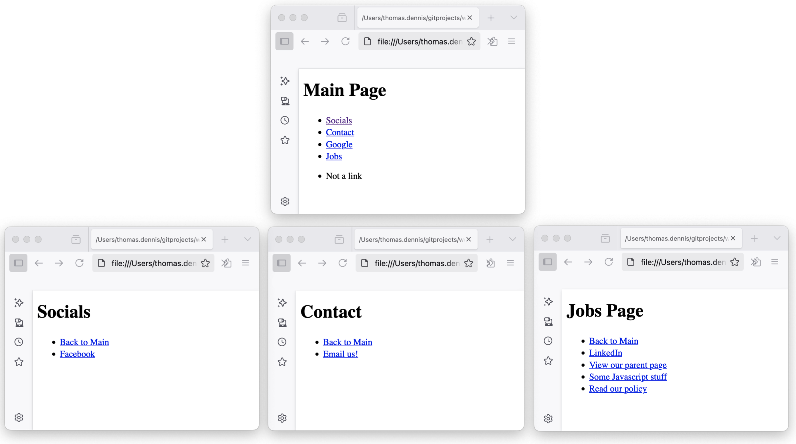

# Web Scraper
## Overview
This is my web scraper written for the Monzo technical interview.

The brief for this task was as follows:
> We'd like you to write a simple web crawler in a programming language you're familiar with. Given a starting URL, the crawler should visit each URL it finds on the same domain. It should print each URL visited, and a list of links found on that page. The crawler should be limited to one subdomain - so when you start with *https://monzo.com/*, it would crawl all pages on the monzo.com website, but not follow external links, for example to facebook.com or community.monzo.com.
> 
> We would like to see your own implementation of a web crawler. Please do not use frameworks like scrapy or go-colly which handle all the crawling behind the scenes or someone else's code. You are welcome to use libraries to handle things like HTML parsing.

## Requirements
- Java 17
- Maven 3.8.6

## Dependencies
- **org.jsoup:jsoup:1.21.1** - for parsing HTML and extracting links
- **org.mockito:mockito-core:3.12.4** - to aid unit testing by allowing mocks
- **junit:junit:4.12** - for unit testing

## Building and Running
To build the project, run the following command in the root directory of the project (i.e: the directory that this `README` file is in):
```bash
mvn clean package
```

To run the project, use the following command (replace `<starting-url>` with the URL you want to start crawling from, e.g. "https://monzo.com"):
```bash
java -jar target/webscrape-1.0-SNAPSHOT.jar <starting-url>
```

# Discussion
I took a total of approximately 4 hours to complete this task, including the initial notes, proof of concept, implementation, and writing this README file.
## Approach
### Initial Notes (approx 15 minutes)
First thing I did was take a pen to paper to get my initial thoughts down:


### PoC: Python and Java (approx 30 minutes)
I sketched up a basic proof of concept in Python and Java 
- I do have some familiarity with Python but not to the extent of my Java knowledge.
- My aim for each PoC was simply to get the string representation of the HTML for a given url.
- I decided to go with the Java implementation as I felt more comfortable with this, also I already have the development setup for Java on my machine.

### Java Implementation (approx 3h)
I expanded on my Java PoC to fulfil the requirements of the task.
- I wrote a simple unit test to get the ball rolling ("test-driven development" for the win!).
  - For this I made some very simple HTML pages to test against, a visual of these is below:

  
- Expanded the PoC to:
  - Extract links from the HTML
  - Transform links to absolute URLs & validate for scraping
- Performed multiple run attempts against `https://monzo.com` to catch edge cases and errors as I went (added to my unit test data and made modifications to my solution as needed).

### Tidy up and README (approx 15 minutes)
Tidied up code comments, Javadocs and wrote this README file.


## Choices: Java
I chose Java for this task because:
- I am most recently familiar with Java, having used it day-to-day for many years now.
- I was already familiar with the junit and mockito libraries, which made it easier to write unit tests.
- Java has a rich ecosystem of libraries, including `jsoup` for HTML parsing, which is well-suited for this task.

## Assumptions
- I spent some time pondering what constitutes a "link" in the context of this task.
- I went with the assumption that links are defined as `<a href="...">` elements in the HTML, whether they are visible to the end user or otherwise.
- I realise there may be many interpretations of this, most visible, clickable HTML elements can be links in their own right.
- I had considered how to build a structured output (e.g. a directed graph) of the links found, but decided to keep it simple and print the links as this is what the task asked for.

## AI Usage
- I kept my usage of AI to a minimum for this task, as I wanted to demonstrate my own understanding and approach to the problem.
- I did plenty of Google searching, and for some of these queries an AI-generated summary was given which helped inform my understanding.
- I used CoPilot autocompletion to help me write JavaDocs and some of this README file, but kept it off for the coding itself.

## Future improvements
- Expand the definition of a link to include other elements that can contain links.
- There are some parts of the WebScraper class that were written with testing in mind, e.g. the `getHtml()` method.
- The architecture of this solution could be extended to be more "production ready":
  - Additional test cases to cover edge cases (malformed HTML, href links, etc).
  - Use of Interfaces with discrete separation of responsibilities, allowing swapping of implementations.
  - Extended error handling and logging.
- Naming conventions (`URL` is used extensively and it being an acronym I found it tricky to know when to capitalise).
- Maybe use a more up-to-date testing framework, I used JUnit4 and Mockito3 as I am familiar with these.
- Refactor to reduce memory usage, currently when running against `https://monzo.com` it eventually hits an error:

  
  
  - I suspect it's a problem with the way I am storing the links and the recursion in play. 
